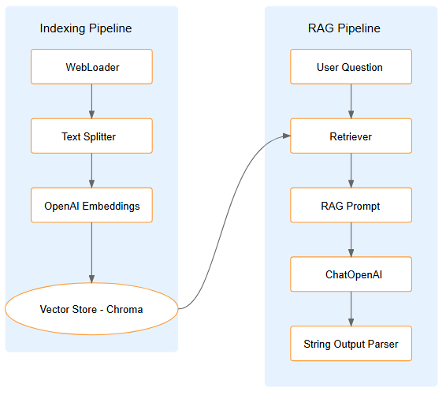

# LangChain RAG Application Project

This project demonstrates the use of LangChain to implement a Retrieval-Augmented Generation (RAG) application. The application integrates prompt templates, LLM chains, retrieval mechanisms, and conversation memory to answer user queries based on content from a web source.

## Getting Started

These instructions will get you a copy of the project up and running.

## Prerequisites


1. **Python (version 3.8 or higher)**
   - Download it from [python.org](https://www.python.org/downloads/).

2. **Git**
   - Download it from [git-scm.com](https://git-scm.com/downloads).


## Installation

### Install required packages:

```bash
pip install --quiet --upgrade langchain langchain-community langchain-chroma
pip install -qU langchain-openai
```

### Set up environment variables:
    
```bash
import os
import getpass

os.environ["OPENAI_API_KEY"] = getpass.getpass()
   ```

### Install additional dependencies:
    
```bash
pip install bs4  # for web scraping
   ```

## Running the RAG Q&A Application

1. Initialize the components:
    
    ```python
    from langchain_openai import ChatOpenAI
    from langchain_community.document_loaders import WebBaseLoader
    from langchain_text_splitters import RecursiveCharacterTextSplitter
    from langchain_chroma import Chroma
    from langchain_openai import OpenAIEmbeddings
   ``` 
2. Load the document content:
    
    ```python
    loader = WebBaseLoader(
    web_paths=("your_url_here",),
    bs_kwargs=dict(
    parse_only=bs4.SoupStrainer(
    class_=("your-target-classes")
    )
    ),
    )
    docs = loader.load()
   
   text_splitter = RecursiveCharacterTextSplitter(chunk_size=1000, chunk_overlap=200)
    splits = text_splitter.split_documents(docs)
   vectorstore = Chroma.from_documents(documents=splits, embedding=OpenAIEmbeddings())
   ```

3. Set up the RAG chain:
    
    ```python
    from langchain_core.runnables import RunnablePassthrough
    from langchain_core.output_parsers import StrOutputParser
   
   rag_chain = (
    {"context": retriever | format_docs, "question": RunnablePassthrough()}
    | prompt
    | llm
    | StrOutputParser()
    )
   ```

4. Query the system:
    
    ```python
    response = rag_chain.invoke("Your question here")
   ```


## RAG Explanation (Retrieval-Augmented Generation)

Retrieval-Augmented Generation (RAG) is a method that integrates external data sources with language models, retrieving relevant data fragments to enhance generated responses. RAG improves response accuracy and quality by allowing the model to access specific contextual information.

## Architecture 

### Architecture Diagram




## High-Level Architecture
The system is composed of two main pipelines:

### Indexing Pipeline
- Document Loading (WebLoader)
- Text Processing (RecursiveCharacterTextSplitter)
- Embedding Generation (OpenAI Embeddings)
- Vector Storage (Chroma)

### RAG Pipeline
- Query Processing
- Context Retrieval
- Prompt Construction
- Answer Generation
- Response Formatting


This project’s architecture follows a client-server model, with the client, represented by a Jupyter Notebook, running code and making API calls to interact with the language model.

**The LangChain core** plays a critical role in integrating with OpenAI. It handles prompt creation, embedding generation, and vector storage, providing the bridge between the client and the language model. LangChain allows the requests sent to OpenAI to be organized and tailored, facilitating interaction with the model.

**The retrieval mechanism** is key to the RAG (Retrieval-Augmented Generation) process. It uses a vector database (vector store) to store relevant document sections, which are indexed and retrieved through embeddings. This system helps identify and extract the most pertinent document parts based on the user's query.

**The OpenAI language model** is responsible for processing the retrieved data and generating responses based on the input prompt. By receiving contextual fragments along with the query, the model produces accurate, context-aware answers enriched with specific details from the document collection.

**LangSmith tracing** offers a logging and monitoring tool for API interactions, which is invaluable for debugging and performance analysis. LangSmith enables the visualization of requests and responses, providing helpful insights for optimizing workflows. This tracing capability ensures better control over execution and helps identify potential improvements in communication between the client and the language model.

## Conclusion  
This RAG Q&A application showcases a powerful architecture for building question-answering systems based on web content. Its modular design enables easy customization and expansion, while the use of cutting-edge components guarantees high-quality results.

### Key benefits:
- Scalable system architecture
- Modular design of components
- High-quality response generation
- Flexible content processing

### Potential future improvements include:
- Support for multiple content sources
- Improved error handling
- Response caching
- Integration of user feedback
- Performance enhancements

## Technologies Used
- Git - Version Control System
- LangChain - Framework for building applications with large language models
- Jupyter Notebook - Interactive development environment
- OpenAI API - API for accessing OpenAI’s language models

## Author

- **Juan David García Pulido** - https://github.com/JuanDavidGarciaPulido


